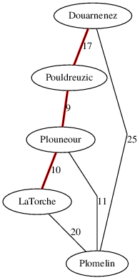

# gps

## Description

Calcul de chemin "au plus court".

## Compilation

```
mkdir build
cd build
cmake ..
make
```

## Utilisation

Le programme `gps.out` lit des routes (villeA villeB distance) dans un fichier
CSV :

```
$ cat finistere.csv 
Douarnenez Pouldreuzic 17
Douarnenez Plomelin 25
vraiment nimporte quoi
Plouneour Pouldreuzic 9
Plouneour Plomelin 11
LaTorche Plomelin 20
LaTorche Plouneour 10
```

puis écrit un fichier au format dot :

```
$ cat finistere.dot 
graph {
    splines=line; 
    Douarnenez -- Pouldreuzic -- Plouneour -- LaTorche [color=red, penwidth=3];
    Douarnenez -- Plomelin [label=25];
    Pouldreuzic -- Douarnenez [label=17];
    Plouneour -- Plomelin [label=11];
    Plouneour -- Pouldreuzic [label=9];
    LaTorche -- Plouneour [label=10];
    LaTorche -- Plomelin [label=20];
}
```

qui permet de générer un graphe, en utilisant graphviz :




